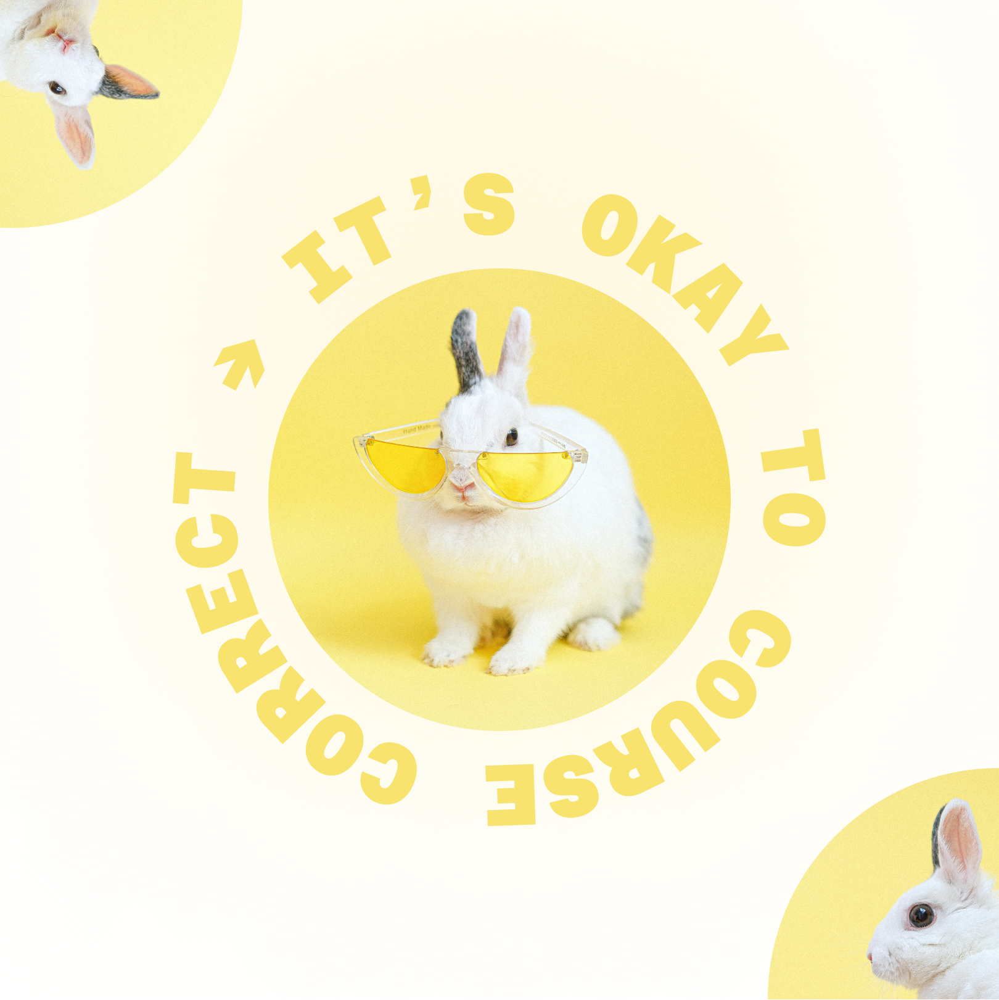

## the year of the (coding) bunny. 🐰

### in which we start moving forward following *our* gut instincts to build burrows of pixels, and start ignoring that old (terrible!) advice to neatly delineate our passion for both design + development into tidy, separate containers.

(that was *really* bad advice, so we’re ignoring that from now on. 🥕 🧡)

- freeCodeCamp Responsive Web Certification Exercises
- Scrimba exercises + notes
- Skillcrush Front End Development refresher + Javascript course

### hey, it’s 5,000% okay to course-correct! just keep moving forward! 🐇⚡